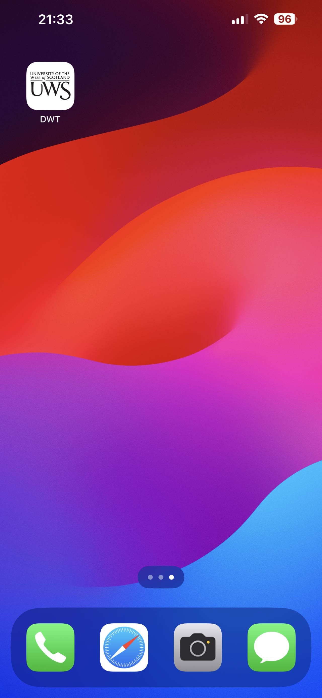

# React + Vite
## environment
We need to import some plug-ins and libraries normally to make the program work properly

Make sure you're in the root directory of your application and run the following terminal command:
npm install nanoid
npm install dexie
npm install dexie-react-hooks

## PWA
We first need to open lighthouse in developer mode to see if the entire application supports pwa.

If the operation is normal, you can perform the following operations:
click here

In this way, you can try to simulate running on the pc side.
## Vercel
If the above steps work properly, you can continue with the following operations:
First, import the project's library into vercel.

The next imported program is deployed to vercel.

After successful deployment, the application interface will be displayed on the left side of the page, of course, it may not be displayed normally, at this time you need to check your relevant configuration file.

If this is displayed correctly, you can click on the connection under Domains. Normally, you'll get the result of the second picture

## Deploy on mobile
If the last step in Vercel appears properly, we can transfer the connection to the phone and open your connection in the browser.

Then we can click Add to Home screen and we have successfully deployed it to our phone.

